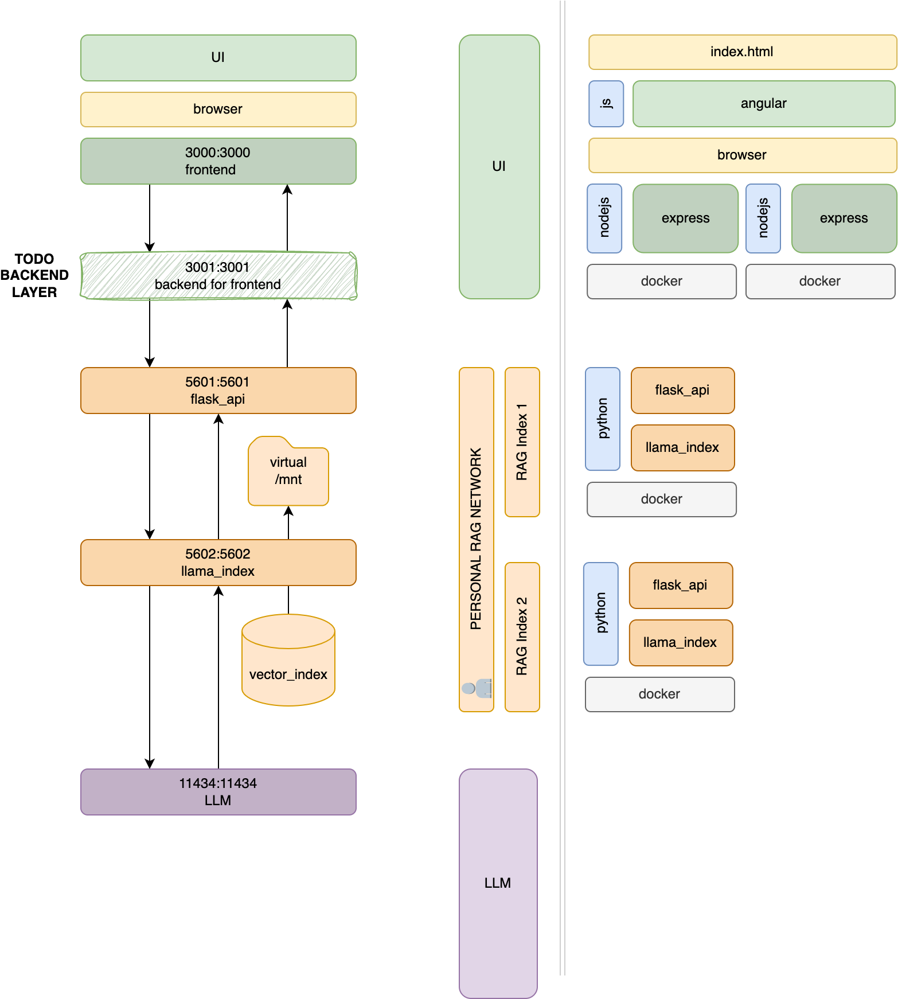

# llama_index_starter_pack

This project is forked from the original repo with flask_react sample of llama_index RAG features.

This repository provides very basic flask, [Streamlit](https://llama-index.streamlit.app/), and docker examples for the [llama_index](https://github.com/jerryjliu/gpt_index) (FKA gpt_index) package.

If you need to quickly create a POC to impress your boss, start here!

If you are having trouble with dependencies, I dump my entire env into `requirements_full.txt`, but otherwise, use the base `requirements.txt`.

The basic demo includes the classic "Paul Graham Essay" from the original llama_index repo. Some good starting questions are
- What did the author do growing up?
- Tell me more about interleaf


## Local Setup
```
conda create --name llama_index python=3.11
pip install -r requirements.txt
```


## flask_react
There are two main example folders
- flask_react (runs 4 services on localhost:5601/5602/3000/11434)
  - `docker compose build`
  - `docker compose up`
  - creates a simple api (`index-server:5601`) that loads the text from the documents folder (if any), also launches the react frontend (`frontend-server:3000`)
  - index-server (container)
    - supervisord is configured on `supervisord.conf` to run python script as system services on container at startup
    - index_server run API layer for vector index, on `index-server:5601` (`index_libs/index_server_api.py`)
    - index_server run also on port (`index-server:5602`) the index service used by the API layer to manage vector_index (`index_libs/index_server.py`)
    - `/index_libs` contain python classes used for index management and server statup
    - the "/query_index" endpoint is a POST endpoint accepts requests that contain a "quer" parameter, which is used to query the index
    - the "/insert_document" endpoint is a POST endpoint that inserts an attached text file into the index
    - the index is managed by a seperate server using locks, since inserting a document is a mutable operation and flask is multithreaded
  - frontend-server (container)
    - supervisord is configured on `supervisord.conf` to serve node server as system services on container at startup
    - A basic frontend using react, which calls the `index_libs/index_server_api.py` to insert, view, and query a GPTSimpleVectorIndex
    - The scope for a frontend is basically limitless - this is intended to give a small taste of what's possible for users less familiar with python
  - llm-server (container)
    - creates an ollama service on dedicated docker container with local llama2 model (`llm-server:11434`)

## Docker
Each container folder contains a `Dockerfile`, root contain the `docker-compose.yml`.
Remember to configure your root `.env` file with secrets an parameters required.


#### Docker Compose
You can run `docker composer build` inside `docker-composer.yml` folder to create docker images based on each Dockerfile container defined on yml.
When images are ready, just run `docker compose up` to run your containers all togheter.



#### Useful docker commands
- docker compose build
- docker compose build --no-cache
- docker compose up
- docker compose up --remove-orphans
- docker system prune
- docker system prune -a

### Environment
Some parameters an configuration can be included into an `.env` file like:

```
  FRONTEND_SERVER_PORT=3000
  INDEX_SERVER_PORT=5602
  JWT_SECRET_KEY=
  JWT_USERS={"username1":{"password":"password1","role":"user","index_id":"0"}}
  API_SERVER_PORT=5601
  LLM_LOCAL_PROVIDER=ollama
  LLM_LOCAL_BASE=llm
  LLM_LOCAL_PORT=11434
  LLM_LOCAL_MODEL=llama2
  LLM_LOCAL_EMBEDDING_MODEL=BAAI/bge-small-en-v1.5
  LLM_CLOUD_PROVIDER=groq
  LLM_CLOUD_BASE=https://api.groq.com/openai/v1
  LLM_CLOUD_PORT=
  LLM_CLOUD_MODEL=mixtral-8x7b-32768
  LLM_CLOUD_KEY=
  LLM_CLOUD_EMBEDDING_MODEL=BAAI/bge-small-en-v1.5
```

- LLM_CLOUD_PORT must be empty and is used only for custom cloud setups
- LLM_CLOUD_PROVIDER can be `openai` and `groq`
- LLM_CLOUD_KEY must be filled with OpenAI or Groq API key from respective playgrouds
- LLM_CLOUD_MODEL must be follow LLM_CLOUD_PROVIDER compatibility
- LLM_LOCAL_MODEL can be any LLM managed by Ollama, default is `llama2`
- JWT_USERS is required only for protected `index-server:5601` routes (/login and /secure)


### Authentication
A rudimental authentication class `index_libs/authenticator.py` can be used to protect routing.

- define on environment the JWT_SECRET_KEY parameter used to encrypt JWT tokens on login
- add autentication layer on your routes like on `/secure` route defined in `index_libs/index_server_api.py`


## streamlit_vector (runs on localhost:8501)
  - `streamlit run streamlit_demo.py`
  - creates a simple UI using streamlit and GPTSimpleVectorIndex
  - loads text from the documents folder (using `st.cache_resource`, so it only loads once)
  - provides an input text-box and a button to run the query
  - the string response is displayed after it finishes
  - want to see this example in action? Check it out [here](https://huggingface.co/spaces/llamaindex/llama_index_vector_demo)

## streamlit_sql_sandbox (runs on localhost:8501)
  - `streamlit run streamlit_demo.py`
  - creates a streamlit app using a local SQL database about restaurant inspections in San Francisco ([data sample](https://docs.google.com/spreadsheets/d/1Ag5DBIviYiuRrt2yr3nXmbPFV-FOg5fDH5SM3ZEDnpw/edit#gid=780513932))
  - The "Setup" tab allows you to configure various LLM and LLama Index settings
  - The "Llama Index" tab demos some basic Text2SQL capabilities using only Llama Index
  - The "Langchain+Llama Index" tab uses a custom langchain agent, and uses the SQL index from Llama Index as a tool during conversations.
  - Check out the huggingface space [here!](https://huggingface.co/spaces/llamaindex/llama_index_sql_sandbox)

## streamlit_term_definition (runs on localhost:8501)
  - `streamlit run streamlit_demo.py`
  - creates a small app that allows users to extract terms/definitions from documents and query against the extracted information
  - pre-loaded with information from the NYC Wikipedia page
  - supports reading text from image uploads
  - allows users to configure LLM settings
  - users can build their own knowledge base of terms/definitions
  - query against these terms as they are added


### Dockerfile
You can run `docker build -t my_tag_name .` to build a python3.11-slim docker image inside your desired folder.
It ends up being about 600MB-900MB depending on the example.
Inside the `Dockerfile`, certain ports are exposed based on which ports the examples need.
When running the image, be sure to include the -p option to access the proper ports (8501).

## Contributing

I welcome any suggestions or PRs, or more examples!
